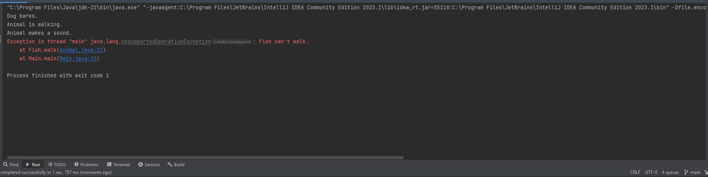
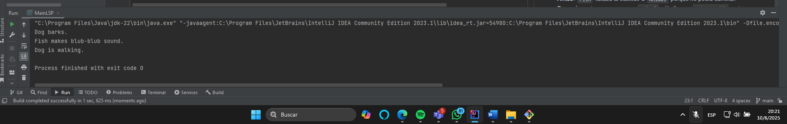

# Ejemplo LSP – Zoológico de Animales

## Descripción
Refactorizamos la jerarquía de animales para respetar el **Liskov Substitution Principle (LSP)**.  
Originalmente, `Fish` heredaba `walk()` de `Animal` y lanzaba excepción. Lo solucionamos separando interfaces.

## Estructura
- **lsp/animal/Animal.java** – interfaz para hacer sonido.
- **lsp/animal/Walkable.java** – interfaz para caminar.
- **lsp/animal/Dog.java** – implementa sonido y caminar.
- **lsp/animal/Fish.java** – solo implementa sonido.
- **lsp/MainLSP.java** – demo de uso.

## Contrato LSP
> “Si S es un subtipo de T, entonces los objetos de tipo T pueden ser reemplazados por objetos de tipo S sin alterar las propiedades del programa.”
- **Antes**: `Fish` fallaba al sustituir a `Animal` porque no podía caminar.
- **Después**: quienes esperan un `Animal` sólo llaman `makeSound()`; quienes esperan un `Walkable` sólo reciben objetos capaces de caminar.

## Ejecución
```bash
javac -d out src/lsp/animal/*.java src/lsp/MainLSP.java
java -cp out lsp.MainLSP
