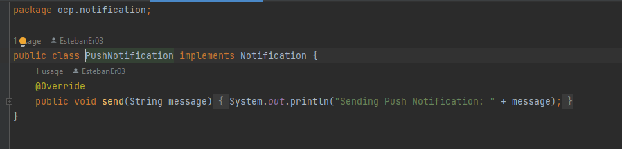

# Proyecto SOLID – Ejemplo OCP: Notificaciones

## Descripción
Refactorizamos un servicio de notificaciones que originalmente usaba un `if/else` para cada canal.  
Aplicamos el **Open/Closed Principle (OCP)** de SOLID, de modo que la clase principal **no requiera cambios** al agregar nuevos tipos de notificación.

## Estructura
- **notification/Notification.java** – interfaz común.
- **notification/EmailNotification.java**
- **notification/SMSNotification.java**
- **notification/PushNotification.java**
- **notification/NotificationService.java** – delega envío usando polimorfismo.
- **Main.java** – demo de uso.

## Reflexión sobre OCP
> El OCP establece que “las entidades de software deben estar abiertas para su extensión, pero cerradas para su modificación”.
> > - **Antes**: modificar `NotificationService` para añadir cada nuevo canal.
> - **Después**: basta con crear una nueva clase que implemente `Notification`, sin tocar código existente.
> - 
## Ejecución
```bash
javac -d bin src/com/tuempresa/solid/ocp/notification/*.java src/com/tuempresa/solid/ocp/Main.java
java -cp bin com.tuempresa.solid.ocp.Main
