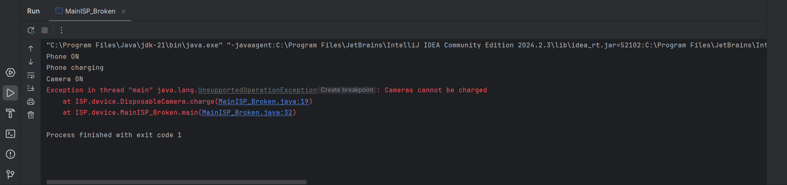
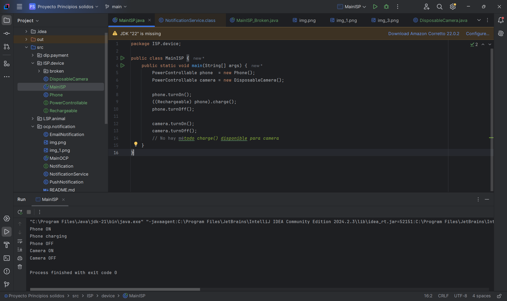

# Proyecto SOLID – Ejemplo ISP: Dispositivos

## Descripción
Demostramos el **Interface Segregation Principle (ISP)** corrigiendo un sistema que  
forzaba a todos los dispositivos a tener el método `charge()`, incluso cuando  
no era necesario. Tras la refactorización cada clase implementa **solo** los  
métodos que utiliza, evitando excepciones en tiempo de ejecución.

---

## 1. Problema original

La interfaz genérica `Device` incluía tres métodos:

```java
void turnOn();
void turnOff();
void charge();
```

`DisposableCamera` debía implementar `charge()` aunque una cámara desechable no se
puede recargar, por lo que lanzaba `UnsupportedOperationException`.

- **Antes**: Codigo de `isp.device.broken` Execepción.

---

## 2. Refactor aplicando ISP

La interfaz Nueva  `Device` incluía tres métodos:


**Implementaciones resultantes:**

- `Phone` → `PowerControllable` y `Rechargeable`

- `DisposableCamera` → `PowerControllable`

El método `charge()` ya no existe para la cámara, de modo que no puede invocarse por accidente.

```css
src/
└─ isp/
   └─ device/
      ├─ PowerControllable.java
      ├─ Rechargeable.java
      ├─ Phone.java
      ├─ DisposableCamera.java
      ├─ MainISP.java
      └─ broken/            (solo evidencia del error)
          ├─ Device.java
          ├─ Phone.java
          ├─ DisposableCamera.java
          └─ MainISP_Broken.java
```
- **Después**: Ejecución de `MainISP.java`  ya con el funcionamiento correcto.


## 3. Reflexión sobre ISP
El ISP establece que “una clase no debe verse obligada a depender de métodos que no usa”.

- **Antes:** el diseño obligaba a implementar `charge()` en todas las clases,
  introduciendo código muerto y excepciones.

- **Después:** las interfaces se segmentaron y cada clase depende únicamente
  de los métodos que realmente necesita, mejorando cohesión y testabilidad.

- **Agregar** un nuevo dispositivo (p. ej. `SolarLamp`) solo requiere implementar
  la(s) interfaz(es) adecuadas; no hay que modificar código existente.


## 4. Ejecución
```bash
javac -d out src/isp/device/*.java src/isp/MainISP.java
java -cp out isp.MainISP
