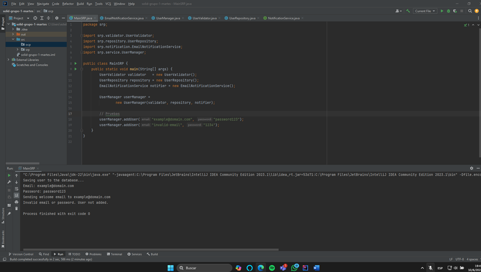

# Proyecto: Gestión de Usuarios con SRP

## Descripción
Este proyecto muestra cómo aplicar el **Principio de Responsabilidad Única (SRP)** en un módulo de gestión de usuarios.  
La clase original `UserManager` combinaba validación, persistencia y notificaciones.  
Se refactorizó en varias clases, cada una con una sola responsabilidad.

## Estructura
- **validator**: validación de email y contraseña.
- **repository**: persistencia en base de datos.
- **ocp.notification**: envío de correos de bienvenida.
- **service**: orquestación de la operación `addUser`.

## Reflexión sobre SRP
> El **SRP** dicta que **cada clase debe tener un único motivo para cambiar**.
> - Antes, un cambio en la lógica de validación, el acceso a datos o el sistema de correo implicaba modificar la misma clase.
> - Ahora, podemos evolucionar o probar cada componente de forma aislada:
    >   - Cambiar la política de contraseñas solo afecta a `UserValidator`.
>   - Cambiar de base de datos solo impacta a `UserRepository`.
>   - Pasar de correo a SMS solo modifica la implementación de `NotificationService`.

## Capturas de pantalla
**

## Cómo ejecutar
1. Compilar: `javac src/com/tuempresa/usermanagement/**/*.java`
2. Ejecutar: `java -cp src com.tuempresa.usermanagement.Main`
